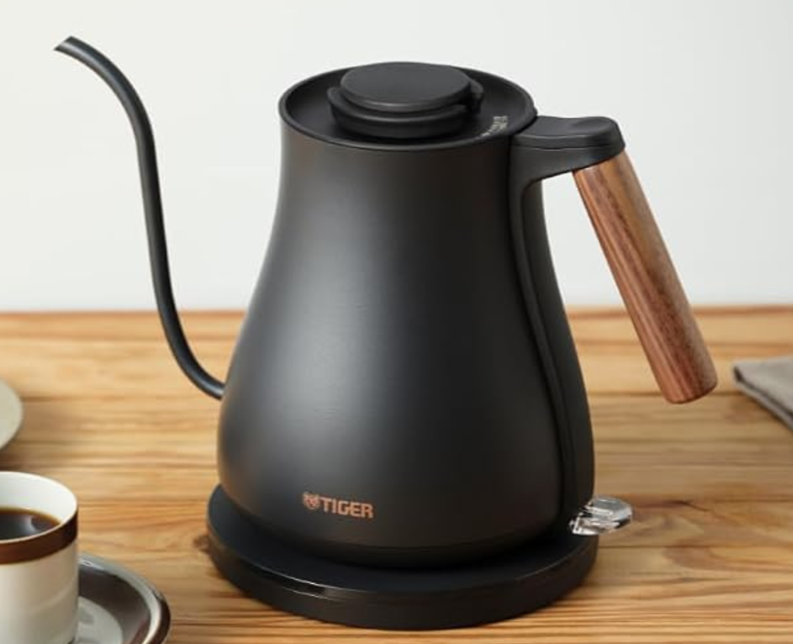
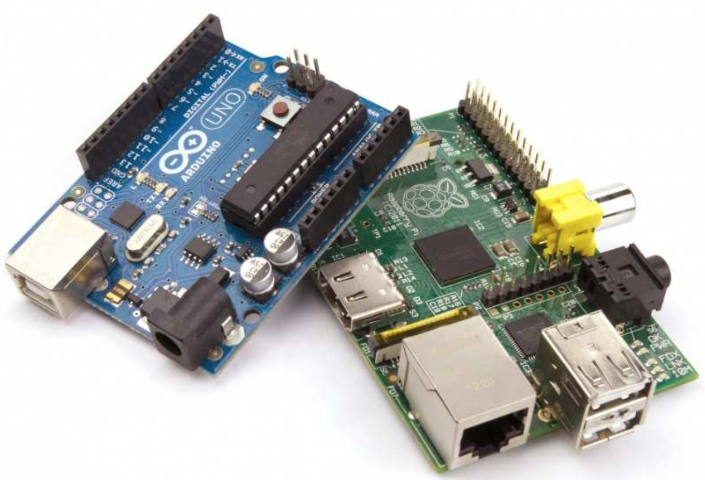
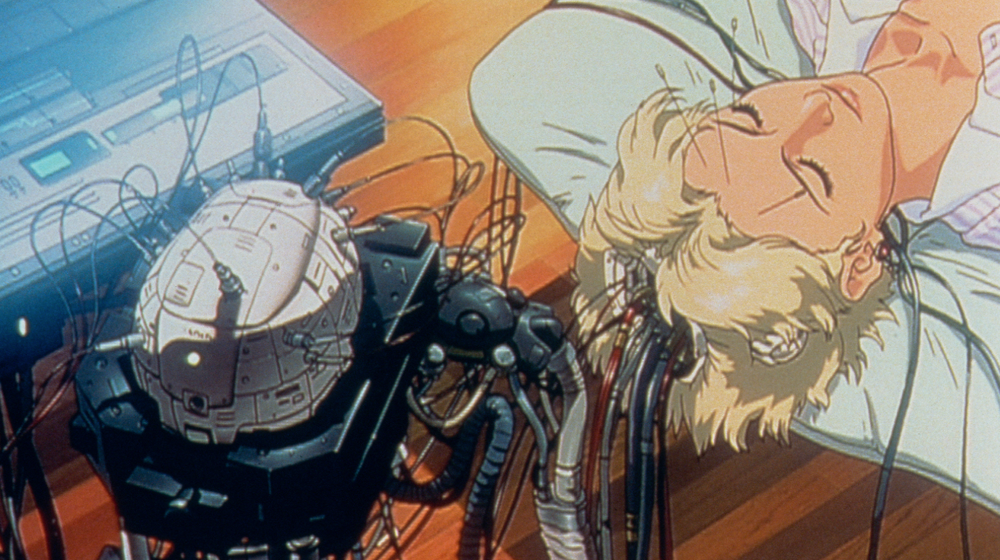

<!-- _class: cover -->

<h1 class="logo"><b>CODE</b>_OF_THINGS</h1>
<p class="title">コード・オブ・シングス :: コードでモノを動かす</p>
<p class="author">&copy; 2026 Satoshi Soma</p>

---

<!-- _class: small -->

## 電気ケトルはなぜ動く

<div class="cols c23 gap">
<div>
<figure class="rounded">

</figure>
</div>
<div>

### サーモスタット式の場合
サーモスタットの中には、熱によって曲がる**バイメタル**が入っている。
バイメタルは熱膨張率の異なる二枚の金属板を貼り合わせた部品で、*温度が上がるにつれて曲がる*。
一定温度に達すると、その動きで電気接点を開いてヒーターへの電流を切る。
電気ケトルで実際に使われる機械式サーモスタットはこの原理によるものが一般的。

<small class="note">参考: [バイメタルのはたらき 4 年生理科](https://www.youtube.com/watch?v=Hsczg5z_Yyg&t=29s)</small>

</div>
</div>

---

<!-- _class: small -->

<div class="cols c23 gap">
<div>
<figure>
<video controls="controls">
  <source src="../.assets/kettle.mov">
</video>
<figcaption>タッチパネルで温度を指定できるタイプ</figcaption>
</figure>
</div>
<div>

### 温度調節式の場合
- ユーザーが指定した温度に達するとヒーターが止まる。
  - ➔ 現在の温度を測る*センサー*が必要。
  - ➔ センサーから情報を受け取り、*ヒーターへの通電を制御する仕組み*が必要。
- 温度を指定するためのボタンやタッチパネルなどの UI も備える。
  - ➔ ユーザーの入力を受け取り、*適切に処理する仕組み*が必要。
  - ➔ 現在の状態を示すためのランプやディスプレイなどの表示器が必要。

このような要求を満たすには、サーモスタット式よりもはるかに*複雑な制御機構*が必要になる。
こうした制御を柔軟に実現する代表的な方法が「**マイコン**」である。

</div>
</div>

---

<!-- _class: small -->

## マイコンとは

<div class="cols c23 gap">
<div>
<figure class="bordered rounded">

</figure>
</div>
<div>

*マイコン<small>（マイクロコントローラ, MCU）</small>* とは、
電子機器を制御するための小さなコンピュータである。

一つのチップの中に、

- プログラムを実行する**CPU**
- プログラムやデータを保存する**メモリ**
- センサーやスイッチなどと接続する**入出力機能**

などがまとめられている。
</div>
</div>

---

<!-- _class: small -->

<div class="cols c23 gap">
<div>
<figure>

```text
          電気ケトル
              │
       ┌──────┴──────┐
       │             │
 タッチパネル     温度センサー
       │             │
       └──────┬──────┘
              ↓
           マイコン
              ↓
       ┌──────┴──────┐
       │             │
    ヒーター       表示器
````

</figure>
</div>
<div>

マイコンには、あらかじめ「どう動くか」という*プログラム*を書き込んでおく。すると、

> 入力 ➔ 処理 ➔ 出力

という流れで、電子機器を制御させることができる。

例えば電気ケトルのマイコンは、

> 温度センサーから温度を読取る（入力）
> ➔ 設定温度と比較する（処理）
> ➔ ヒーターを制御する（出力）

> タッチパネルへの入力情報を読取る（入力）
> ➔ 設定温度をメモリへ保存（処理）
> ➔ パネルの表示に情報を反映（出力）

といった制御を行っている。

</div>
</div>

---

<div class="cols gap">
<div>
<figure>

<figcaption>電脳（攻殻機動隊）</figcaption>
</figure>
</div>
<div>
電子機器を人体に例えるなら、

マイコンは*頭脳*にあたると言えるだろう。

そしてセンサーは外界からの刺激を受け取る*感覚器官*に相当する。

ヒーターやディスプレイ、モーターなどのあらゆる出力装置は、我々にとっての*手足や顔、声帯*などにあたるものと言えるかもしれない。

</div>
</div>


